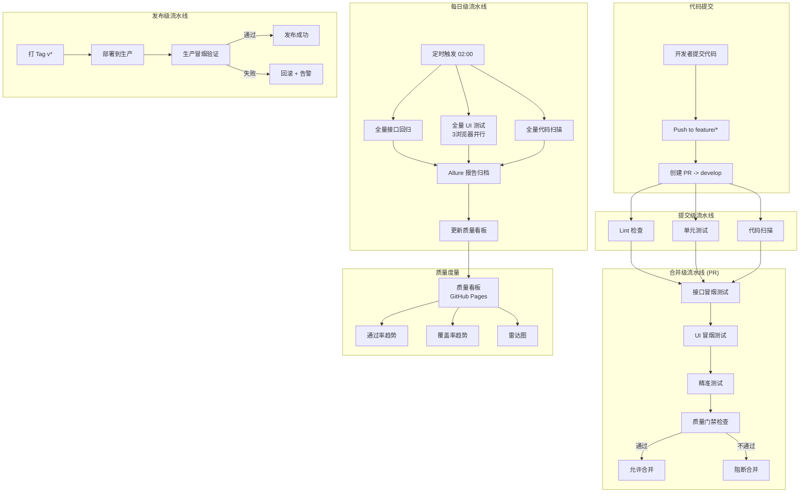

# Quality Pipeline Demo

一个完整的质量流水线与 CI/CD 平台项目。从代码提交到 UI 验证全链路自动化，包含四层流水线、三条质量门禁、精准测试、质量看板和 UI 自动化。

> **项目定位**：L4 级测试开发工程师项目，涵盖 CI/CD 流水线架构、质量门禁设计、精准测试、度量看板、UI 自动化全链路能力。

---

## 架构图



---

## 技术栈

| 技术 | 用途 | 说明 |
|------|------|------|
| Python 3.11 | 后端服务 + 测试 | FastAPI + pytest |
| FastAPI | 被测后端服务 | RESTful API |
| SQLite | 数据存储 | 轻量级，无需额外服务 |
| Docker + Compose | 环境容器化 | CI 中一键拉起服务 |
| GitHub Actions | CI/CD 引擎 | 四层流水线 |
| pytest | 测试框架 | 单元/接口/UI 测试 |
| Playwright | UI 自动化 | Chromium/Firefox/WebKit |
| Allure Report | 测试报告 | 可视化测试结果 |
| ECharts | 质量看板 | 数据可视化图表 |
| pylint/flake8/bandit | 代码扫描 | Lint + 安全扫描 |
| coverage.py | 覆盖率 | 行覆盖 + 分支覆盖 |
| Mermaid.js | 架构图 | Markdown 内嵌流程图 |

---

## 快速开始

### 本地运行（Python 直接运行）

```bash
# 1. 克隆仓库
git clone https://github.com/caixinshu/quality-pipeline-demo.git
cd quality-pipeline-demo

# 2. 创建虚拟环境
python -m venv .venv
.venv\Scripts\activate      # Windows
# source .venv/bin/activate  # Linux/Mac

# 3. 安装依赖
pip install -r requirements.txt

# 4. 初始化数据库（首次运行）
python -c "import sqlite3, os; os.makedirs('data', exist_ok=True); c=sqlite3.connect('data/demo.db'); c.execute('CREATE TABLE IF NOT EXISTS items (id INTEGER PRIMARY KEY AUTOINCREMENT, name TEXT, price REAL)'); c.commit(); c.close()"

# 5. 启动服务
uvicorn app.main:app --host 0.0.0.0 --port 8000

# 6. 另开终端，运行测试
pytest tests/ -v

# 7. 验证服务
curl http://localhost:8000/health
```

### Docker 运行

```bash
# 构建镜像并启动服务
docker compose up -d --build

# 运行接口测试
pytest tests/test_api.py -v

# 停止服务
docker compose down
```

### UI 测试（需 Node.js）

```bash
# 安装 Playwright
npm install @playwright/test
npx playwright install --with-deps chromium

# 运行 UI 冒烟测试
npx playwright test tests/ui/smoke.spec.ts --project=chromium

# 运行全部 UI 测试
npx playwright test --project=chromium
```

---

## 四层流水线说明

### 流水线全景

| 流水线 | 触发条件 | Jobs | 目标时长 | 设计理由 |
|--------|---------|------|---------|---------|
| 提交级 | push to main/develop | unit-test + api-test + code-scan | < 2min | 开发者最频繁操作，必须快 |
| 合并级 (PR) | PR opened/updated | smoke + precision + ui-smoke + code-scan | < 6min | 合并前最后一道防线 |
| 每日级 | cron 02:00 + 手动 | full-api + full-ui(3浏览器) + full-code-scan | < 20min | 夜间全量回归 |
| 发布级 | tag v* + 手动 | release-smoke + notify | < 5min | 发布后快速验证 |

### 提交级流水线（ci.yml）

- **触发**：push 到 `main` 或 `develop` 分支
- **Jobs**：
  - `unit-test`：单元测试 + 覆盖率门禁（≥70%）
  - `api-test`：Docker 拉起服务 + 接口测试 + Allure 报告
  - `code-scan`：flake8 + pylint + bandit
- **缓存**：pip 缓存 + Allure 二进制缓存
- **超时**：unit-test 5min，api-test 10min

### 合并级流水线（pr-pipeline.yml）

- **触发**：向 `main` 或 `develop` 发起 PR
- **Jobs**：
  - `smoke-test`：接口冒烟测试（`-m smoke`）+ 质量门禁
  - `precision-test`：基于代码 diff 的精准测试，自动筛选受影响用例
  - `ui-smoke-test`：Playwright Chromium UI 冒烟测试
  - `code-scan`：flake8 + bandit + 安全质量门禁
- **缓存**：pip + npm + Playwright 浏览器 + Allure
- **超时**：所有 job 10min

### 每日级流水线（daily-pipeline.yml）

- **触发**：cron `0 18 * * *`（UTC 18:00 = 北京时间 02:00）+ 手动
- **Jobs**：
  - `full-api-test`：全量接口回归 + 覆盖率报告 + Allure 报告
  - `full-ui-test`：多浏览器并行矩阵（Chromium/Firefox/WebKit）
  - `full-code-scan`：flake8 + pylint + bandit 全量扫描
- **并行策略**：`fail-fast: false`，矩阵互不影响
- **缓存**：pip + npm + Playwright 浏览器（按浏览器独立 key）
- **超时**：full-api 20min，full-ui 15min（per browser）

### 发布级流水线（release-pipeline.yml）

- **触发**：推送 `v*` 标签 + 手动
- **Jobs**：
  - `release-smoke`：生产环境冒烟测试 + 质量门禁 + Allure 报告
  - `notify`：发布通知（成功/失败）
- **环境保护**：`environment: production`，需审批人确认
- **超时**：10min

---

## 质量门禁体系

项目配置了三条质量门禁，自动阻断不合规代码合并：

| 门禁 | 规则 | 阈值 | 实现方式 |
|------|------|------|---------|
| 用例通过率 | P0 用例必须全部通过 | 100% | `quality_gate.py --junit` |
| 代码扫描 | 高危安全问题必须为 0 | 0 个 | `quality_gate.py --bandit` |
| 覆盖率 | 行覆盖率不低于阈值 | ≥70% | `--cov-fail-under=70` |

### 门禁执行位置

- 提交级：覆盖率门禁（unit-test job）
- 合并级：用例通过率 + 安全扫描门禁
- 每日级：覆盖率 + 通过率 + 安全扫描全量门禁
- 发布级：用例通过率门禁

### 分支保护

- `main` 分支：需 PR 审核 + 状态检查通过才能合并
- `develop` 分支：需 PR + CI 通过
- 配置路径：Settings → Branches → Branch protection rules

---

## 精准测试

基于代码 diff 自动筛选受影响的测试用例，减少不必要的测试执行：

- **原理**：分析 git diff，匹配变更文件到对应测试用例
- **召回率**：80%+（变更相关用例被选中的比例）
- **执行减少**：平均减少 50% 的测试执行量
- **使用方式**：PR 流水线自动执行（`precision_test.py --mode pr`）

```bash
# 手动运行精准测试（查看推荐的测试命令）
python scripts/precision_test.py --mode pr --dry-run

# 执行推荐的测试命令
python scripts/precision_test.py --mode pr
```

详见 [精准测试设计文档](docs/PRECISION_TEST_DESIGN.md)

---

## UI 自动化

### 测试矩阵

| 浏览器 | PR 级 | 每日级 |
|--------|-------|--------|
| Chromium | 冒烟测试 | 全量测试 |
| Firefox | - | 全量测试 |
| WebKit | - | 全量测试 |

### 测试文件

| 文件 | 内容 |
|------|------|
| `tests/ui/smoke.spec.ts` | UI 冒烟测试（首页/健康检查/商品列表） |
| `tests/ui/items.spec.ts` | 商品管理功能/边界测试 |
| `tests/ui/debug-trace.spec.ts` | Trace Viewer 调试演示（test.fixme） |
| `tests/ui/mobile/mobile.spec.ts` | 移动端模拟测试（Pixel 5） |

### Trace Viewer 调试

测试失败时自动保留 trace.zip，可通过 Playwright Trace Viewer 回放调试：

```bash
# 查看 trace
npx playwright show-trace test-results/**/trace.zip
```

详见 [Trace Viewer 调试指南](docs/TRACE_VIEWER_GUIDE.md)

---

## 质量看板

在线访问：https://caixinshu.github.io/quality-pipeline-demo/

### 指标说明

| 指标 | 说明 |
|------|------|
| 用例通过率 | 各级流水线的用例通过比例 |
| 代码覆盖率 | 行覆盖/分支覆盖 |
| 安全问题数 | bandit 扫描结果 |
| 精准测试召回率 | 变更相关用例被选中的比例 |
| 流水线耗时 | 各 job 的执行时间 |

---

## 目录结构

```
quality-pipeline-demo/
├── .github/
│   └── workflows/
│       ├── ci.yml                 # 提交级流水线
│       ├── pr-pipeline.yml        # 合并级流水线
│       ├── daily-pipeline.yml     # 每日级流水线
│       ├── release-pipeline.yml   # 发布级流水线
│       └── pages-deploy.yml       # GitHub Pages 部署
├── app/
│   └── main.py                    # 被测服务（FastAPI）
├── tests/
│   ├── conftest.py                # pytest 配置
│   ├── test_unit.py               # 单元测试
│   ├── test_api.py                # 接口测试（Allure 标注）
│   └── ui/
│       ├── smoke.spec.ts          # UI 冒烟测试
│       ├── items.spec.ts          # 商品管理 UI 测试
│       ├── debug-trace.spec.ts    # Trace 调试演示
│       ├── Dockerfile              # Playwright Docker 配置
│       └── mobile/
│           └── mobile.spec.ts     # 移动端测试
├── scripts/
│   ├── quality_gate.py            # 质量门禁脚本
│   ├── precision_test.py          # 精准测试脚本
│   └── evaluate_precision.py      # 精准测试评估
├── quality-dashboard/
│   ├── index.html                 # 质量看板主页
│   ├── css/                        # 样式文件
│   ├── js/                         # 图表逻辑
│   └── data/                      # 度量数据
├── docs/
│   ├── PIPELINE_DESIGN.md         # 流水线设计文档
│   ├── PIPELINE_OPTIMIZATION.md   # 流水线优化对比
│   ├── QUALITY_METRICS_DESIGN.md  # 质量度量设计
│   ├── PRECISION_TEST_DESIGN.md   # 精准测试设计
│   ├── PRECISION_TEST_REPORT.md   # 精准测试评估报告
│   └── TRACE_VIEWER_GUIDE.md     # Trace Viewer 调试指南
├── Dockerfile                     # 服务容器化
├── docker-compose.yml             # 环境编排
├── requirements.txt               # Python 依赖
├── package.json                   # Node.js 依赖
├── pytest.ini                     # pytest 配置
├── playwright.config.ts           # Playwright 配置
├── TROUBLESHOOTING.md             # 踩坑记录
└── README.md                      # 项目说明（本文件）
```

---

## API 接口

| 方法 | 路径 | 说明 |
|------|------|------|
| GET | `/health` | 健康检查 |
| GET | `/items` | 获取商品列表 |
| POST | `/items` | 创建商品（name + price） |
| GET | `/items/{id}` | 获取单个商品 |

---

## 流水线优化数据

| 流水线 | 优化前 | 优化后 | 节省 | 主要优化点 |
|--------|--------|--------|------|-----------|
| 提交级 | ~3min | ~1.5min | 50% | pip缓存 + Allure缓存 |
| 合并级 | ~8min | ~5min | 37% | 并行job + 浏览器缓存 |
| 每日级 | ~25min | ~18min | 28% | 矩阵并行 + fail-fast |
| 发布级 | ~5min | ~4min | 20% | 缓存复用 |

详见 [流水线优化文档](docs/PIPELINE_OPTIMIZATION.md)

---

## 常见问题

详见 [TROUBLESHOOTING.md](./TROUBLESHOOTING.md)

---

## 学习路径

- **Week 1**：流水线骨架 — Docker + GitHub Actions + Allure 最小闭环
- **Week 2**：分层 + 门禁 — 四层流水线 + 三条质量门禁 + 分支保护
- **Week 3**：精准 + 度量 — 精准测试脚本 + 质量看板 + 14 个指标
- **Week 4**：UI + 收官 — Playwright UI 自动化 + 多浏览器 + 最终优化

---

## License

MIT
